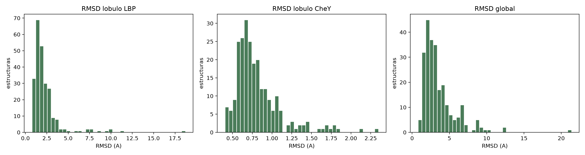
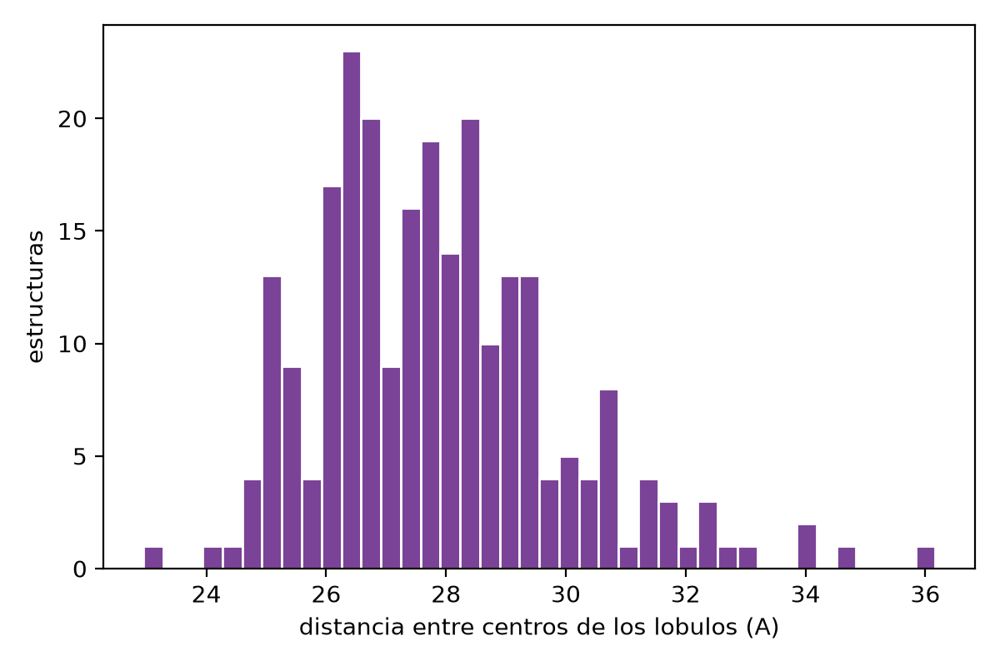

# Ensamble conformacional de la quimera LBPCheY con BioEmu

Ensamble de equilibrio de la proteína quimérica **LBPCheY** (339 residuos), en la que
el dominio CheY está insertado en la proteína de unión a leucina (LBP), generado con
[BioEmu](https://github.com/microsoft/bioemu) a partir de la secuencia del modelo 0
de AlphaFold3 (AlphaFold Server).

La pregunta: los dos lóbulos se pliegan bien por separado, pero ¿se mueven uno
respecto al otro?

> **Aviso de términos de uso.** Los archivos de `alphafold3/` son salida de AlphaFold
> Server, y los de `bioemu/` y `figuras/` derivan de ella (usan su secuencia y su
> modelo como referencia). Se distribuyen bajo y sujetos a los
> [AlphaFold Server Output Terms of Use](https://alphafoldserver.com/output-terms)
> (copia en `alphafold3/TERMS_OF_USE_AlphaFold_Server.md`): solo uso no comercial,
> sin usarlos para entrenar modelos de predicción de estructura ni en sistemas
> automatizados de predicción de unión a ligandos. Modificaciones respecto a la
> salida original: ninguna en el `.cif`; el ensamble es un derivado generado con BioEmu.

## Dominios (numeración 1-indexada)

| Región | Residuos |
|---|---|
| LBP N-terminal | 1–140 |
| CheY | 141–243 |
| LBP C-terminal | 244–339 |

## Pipeline

1. **AlphaFold3** (AlphaFold Server): modelo 0, pTM = 0.81 (`alphafold3/`).
2. **BioEmu v1.4.1**, checkpoint `bioemu-v1.1`, 300 muestras con MSA de ColabFold.
   El filtro de calidad de BioEmu deja **246**.
3. **Cadenas laterales** con HPacker y **minimización local** con OpenMM
   (amber99sb + TIP3P, backbone restringido), con `bioemu.sidechain_relax`.
4. **Análisis** (`scripts/analiza_ensamble.py`): RMSD de Cα por lóbulo contra el modelo
   de AF3 y distancia entre los centros de masa de los dos lóbulos.

`scripts/run_bioemu.sh` corre los pasos 2 y 3. Las rutas del script son las
del servidor original; ajústalas antes de usarlo. El paso a paso completo, con
entradas, salidas y tiempos, está en **[TUTORIAL.md](TUTORIAL.md)**. Cómo funciona
BioEmu por dentro está explicado en **[BIOEMU.md](BIOEMU.md)**.

## Resultados

| Medida (Å) | Media ± sd | Rango |
|---|---|---|
| RMSD lóbulo CheY | 0.81 ± 0.30 | 0.40 – 2.35 |
| RMSD lóbulo LBP | 2.30 ± 1.87 | 0.76 – 18.71 |
| RMSD global | 3.56 ± 2.32 | 0.79 – 21.37 |
| Distancia entre centros de los lóbulos | 27.9 ± 2.0 | 23.0 – 36.2 |

- **CheY** se mantiene prácticamente rígido y muy parecido al modelo de AF3.
- **LBP** también se conserva en general, pero tiene unas cuantas muestras muy alejadas
  del modelo.
- **Entre los lóbulos** hay movimiento: el RMSD global es mayor que el de cada lóbulo y
  la distancia entre centros varía unos 13 Å.




Las estadísticas se calcularon con el ensamble de backbone de BioEmu (antes de la
minimización) y los centros de masa con los Cα.

## Archivos

| Ruta | Contenido |
|---|---|
| `alphafold3/` | Modelo 0 (`.cif`), resumen de confianza, solicitud del trabajo y términos de uso |
| `bioemu/ensamble_lbpchey.pdb.gz` | 246 estructuras minimizadas (átomos pesados) en un PDB multimodelo, alineadas sobre LBP y **ordenadas de cerrada a abierta** |
| `bioemu/orden_apertura.txt` | Para cada estado: muestra original y distancia entre lóbulos |
| `bioemu/repr_{cerrada,mediana,abierta}.pdb` | Estructuras representativas (solo backbone) |
| `bioemu/lbpchey_model0.fasta` | Secuencia usada |
| `visualizacion/ver_ensamble.pml` | Script de PyMOL |
| `scripts/` | `run_bioemu.sh`, `analiza_ensamble.py` y `prepara_visualizacion.py` |
| `BIOEMU.md` | Cómo funciona BioEmu por dentro, con referencias |
| `TUTORIAL.md` | Cómo se ejecutó todo el pipeline, paso a paso |
| `presentacion/` | Presentación sobre BioEmu y este caso (`.pptx` y `.pdf`) |

## Visualizar en PyMOL

Desde la raíz del repositorio:

```bash
pymol visualizacion/ver_ensamble.pml
```

Fondo negro, todo en cartoon. LBP en gris, CheY en naranja, el modelo de AF3 en azul.
Las representativas (`cerrada`, `mediana`, `abierta`) empiezan apagadas.

- `mplay` / `mstop` reproducen la película de cerrada a abierta.
- `set all_states, on` muestra los 246 estados encimados.

Los estados son muestras independientes del equilibrio, no una trayectoria
temporal, así que la película puede tener saltos.
